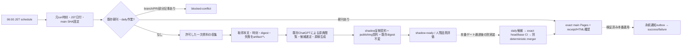

# JAMIO NEWS Autonomous Publication v1

追跡Issue: [#15](https://github.com/hm2236/jamio-news/issues/15)。現段階は **read-only shadow**。既存ChatGPT予定タスクを編集制作者として維持し、新しいLLM API課金・キーは導入しない。GitHub ActionsでLLMが動くと仮定しない。自動マージ・日刊候補PR・本番刊行・チャット通知はこの実装から実行しない。

シリーズ判定は[連続ニュースの設計](news-series-design.md)、[段階2のdetached proposal shadow](news-series-shadow.md)、[Issue #18](https://github.com/hm2236/jamio-news/issues/18)で追跡します。現行shadowの朝刊限定・fresh eventUrl条件を維持し、提案を公開データと分離して検証します。LLM自動接続と7連続日の実評価は未完了です。guarded付与は本稿の全本番ゲートに加え、activeシリーズへのappend限定・証拠binding・別navigation receiptを必要とします。現行daily guardの許可範囲はまだ変更しません。

## 初期shadow監査の履歴（2026-10-06 JST）

GitHubからfresh cloneしたmainは `908a856aaed48fa0052bd0bcbe7e3fe1e367e5ac`。repoおよび作業ディレクトリの祖先にAGENTS.mdなし。README、editorial-policy、morning-pipeline、chatgpt-morning-prompt、publishing.schema、全既存workflowとproduction/daily-pr/remote-proof/confirm/verify-deploymentを正本として確認した。

- 10月6日朝刊の[PR #14](https://github.com/hm2236/jamio-news/pull/14)はmerge済み。head `e4534bf48d196e01bebfeb2e049608a9776d660c` に対するguard/buildはsuccess、上記mainに対する[Pages run 37383840062](https://github.com/hm2236/jamio-news/actions/runs/37383840062)もsuccess。
- deploy job `112012210459` の最終検証ログに `JAMIO_PUBLIC_RECEIPT status=receipt-verified`、commit=上記main、date=2026-10-06、slug=2026-10-06-morning、variant=morning、URL=`https://hm2236.github.io/jamio-news/editions/2026-10-06-morning/`、digest=`c4f9e62fe8d39fd6d587991e58ca51042dae5801591ed8f0caa4f1e8750dbc06` を確認。既存のActionsログfallback経路で公開を確定できる。同日の追加制作は不要。
- open PRなし。関連基盤PR #1/#2/#3は契約・trusted guard・API-only公開証明、#8/#9は版識別と既存digest維持。#11〜#13は朝夕導線・表示。全75既存テスト、validate、buildが成功。
- GitHub branches/mainの `protected=false`、rulesetsは `[]`。CIは実装されているが、必須チェック・レビューをサーバー側で強制しているとは言えない。これはguarded automatic publicationのブロッカー。
- repoには収集・LLM生成・通知台帳・ネイティブscheduled triggerがない。従来の外部ChatGPT手順は正確なhead/base、expected-head merge、exact main SHA Pages＋receipt/HTML照合を要求するが、接続権限や予定タスク実runの可用性は今回のrepo監査だけでは証明できない。
- この基盤変更では本番記事/価格/既存publishing.schema/guard/Pages workflowを変更しない。追加証拠契約はshadow用の別契約であり、まだ日刊PRの必須ゲートではない。

## PR-1 authoritative check hardening（2026-10-07）

取得mainは5ef7e629707e89b0b2afcb9dd0cefa821f5e33c8。上のshadow初期監査は履歴であり、現状の予定収集不在を意味しない。Issue #15と最新コメントを確認。main protectionは404 Branch not protected、rulesetsと適用branch rulesは空。設定は変更しない。

全PRでtrusted guardを実行し、infrastructure/code/docsだけならpass、non-dailyのcontent/またはdata/prices.json変更はfail。daily候補は最新expected base・全commit履歴・add-only・最後のedition seal・記事集合・全既刊digestを検証する。multi-commit Contents v1は価格を書かない。単一commit local/Workだけ既存append-only価格契約を維持する。未来published/前日のslug/翌日rerunは拒否し、receiptは次のJST midnightに失効する。GitHub checkの成功自体は自動失効しないので、将来mergerには時刻・head/baseの最終fenceが必須。

2026-10-07 Scheduled Taskで低水準Git Data API ref更新ルートは失敗した。今後の方向は高水準Contents API create-fileによるadd-only候補だが、このPRはwriterを実装/有効化せず予定タスク設定も変更しない。unsigned attempt trailerは混在を決定的に検出する補助で、同markerの偽装や意味的な混在を認証できない。producer認証・durable leaseは依然別ゲート。

訂正metadataは存在するがcorrectionの認可契約は未実装。レビュー済みという宣言ではprotected-content変更を通さない。歴史的保守/訂正を可能にする契約は独立レビューで追加する。

PR-1時点ではmainのrunning Pages workflowのcancelだけを抑止し、pending runは単一枠だった。現在のC3a契約は次節に従う。公開receipt検証成功前のpublished通知は禁止。

## C3a Pages直列化・stale復旧deploy防止

`pages.yml` のworkflow-level concurrencyは `group: pages-${{ github.ref }}` と `queue: max`。mainのbuild → deploy → edition/series receipt検証まで全体を直列化し、pending main pushを置換せず最大100件保持する。`cancel-in-progress` は指定しない。PRもrefごとにqueueする。[GitHub concurrency仕様](https://docs.github.com/en/actions/how-tos/write-workflows/choose-when-workflows-run/control-workflow-concurrency)のFIFOはgroupで待機を始めた順であり、dispatch順の絶対保証ではない。通常A → B → Cのmain pushはA完了 → B完了 → C完了を期待する。上限超過分はcancelされ得るため無制限/永続queueではない。

original main `push` の `run_attempt == 1` はqueue内でmainが進んでもdeployできる。push rerun（`run_attempt > 1`）と全 `workflow_dispatch` は [pages-deploy-fence.mjs](../scripts/pages-deploy-fence.mjs) が `actions/deploy-pages` 直前にGitHub APIからcurrent `refs/heads/main` tipをread-only取得し、`github.sha` と完全一致を要求する。stale SHA、取得不能、不正応答はdeploy前に非ゼロ終了する。main以外のmanual dispatchはbuild開始時に失敗し、deploy jobもmain限定。repository write権限は追加しない。

mainが進んだ後の古いmain Pages runは、全job/失敗job/deploy jobのいずれも手動rerunしてはならない。stale rerun/manual dispatchはこのfenceを含むworkflowでdeploy前にblockedとなる。ただしGitHubのrerunは元runのworkflow定義を使うため、C3a導入前の古いrunにはfenceが遡及適用されない。復旧はcurrent mainのworkflowで行い、古いtreeを再deployしない。

exact-SHA確認を引き続き正本とし、exact workflow/public receipt/HTMLが失敗・未確認ならfail-closedでpublishedにしない。mainが進んだ後の旧targetに後続SHAの成功を代用せず、記事再生成や古いdeploy rerunで回避しない。later-descendant containmentは別の将来architecture判断・独立レビューに留める。現在の `verify-deployment.mjs` はdeployed SHAの完全manifestと最新号HTMLを検証するため、後続SHAで最新号が変わる場合に旧targetの証明とするにはtarget HTML / fallback proof契約の別設計が必要。writer、deterministic merger、Scheduled Task publication、notifierは有効化しない。

### 次の人手GitHub設定（このPRでは変更しない）

Settings → Rules → Rulesetsでactive branch rulesetを用意する。mainにRestrict deletions、Block force pushes（non-fast-forward禁止）、Require a pull request before merging、Require status checks to passとRequire branches to be up to date before mergingを設定する。必須check contextはdaily-guard（Daily publication guard）とbuild（Publish JAMIO NEWS）。[GitHub rulesets公式仕様](https://docs.github.com/en/repositories/configuring-branches-and-merges-in-your-repository/managing-rulesets/available-rules-for-rulesets)に従う。GitHubの実check名を確認し、expected source/integrationは可能ならGitHub Actions Appを選ぶ。現在mainのbuild checkでapp slug=github-actions、app ID=15368を確認済み。daily-guardも対象PRのcheckから同Appを確認して選ぶ。bypass listは空、管理者/owner/Appを含む例外を作らない。approval countは0でよい（単独ownerはself-approval不可）。daily/**にもforce push禁止を設定する。

現在public repositoryのruleset/read APIは利用でき、admin permissionも確認できるが、write能力は本タスクで試さない。required-check integration_idやstrict設定は管理者が実checkから確認する。check成功のdate自動失効、Contents writer/mergerの認証・lease、pending deployの全件キューはrulesetでは提供されない。サーバー保護の欠如は自動刊行に対するP0 blockerとして残る。

## 最小安全アーキテクチャ



実線のGitHub自動実装はC/X/R/Aと既存号のVまで。Eは既存ChatGPT側の担当で、A→Eの自動接続は未実証。Qは実装済みのread-only CLI。H→PとV→Nは本番移行ゲート後の設計。予定タスクが存在すること・自律的にGitHub writeできることを推測で完了扱いしない。

## Shadow運用

`.github/workflows/autonomous-shadow.yml` は毎日UTC21:00（JST06:00）とworkflow_dispatchで起動する。main・hm2236/jamio-news限定。scheduleが遅れれば実際の**元runのcreated_at**をJSTへ変換してdate/slugを固定し、開始を偽装しない。rerunでも元created_atを使い、翌日へ持ち越さない。runId/attempt/baseSha/windowStartを照合し、開始から2時間超・JST日付変更・main前進・attempt変更はstaleで停止する。07:00は目標であり検証省略の根拠ではない。

権限はcontents/actions/pull-requestsのreadのみ、checkout資格情報は保存しない。job全体10分、source取得はredirect/bodyを含め15秒・1MiB上限、redirect最大3回。順次15か所を収集し、追加原典は1回最大30URL。HTTP/取得制限/timeout/文字コード/本文不足/サイズ/redirect失敗を記録する。新しいsecret・パッケージ・有料API不要。

global concurrencyは並列shadowを直列化し、実行中を取り消さない。GitHubのconcurrencyは永続的な制作leaseでも全runを保存するキューでもない。実行はread-onlyなので重複起動は公開を重複させない。日刊branch/PRは読み取り、存在時は勝手に取り込まず所有者との調整が必要なblocked-conflictとする。mainに号があれば公開確認だけを実行し、Pages失敗で記事を再生成しない。

`morning-shadow-<runId>-<attempt>` artifact（14日保持）とjob summaryに状態を残す。ファイルは排他的作成で既存reportを上書きしない。失敗はfailure.jsonと非ゼロ終了。timeout/runner喪失でファイルがない場合はActions run/job状態が正本。`awaiting-editorial` は収集完了・生成待ち、`shadow-ready` は評価済み候補で、どちらもpublishedではない。`already-published`は既存公開済み号の再確認で、再公開・再通知しない。

通知は現在Actions結果・summary/artifactまで。チャット/email/Slackへの配信・到達保証は未接続。GitHubユーザーのActions通知設定に依存するため、成功/失敗の外部通知が完成したとは報告しない。

## 編集・証拠契約

`config/research-sources.json`はAI、hardware、vr、deals、local、life全6テーマの一次資料入口。OpenAI/Anthropic/Google/llama.cpp、NVIDIA/AMD/Intel、Meta/VRChat、国内販売店、鹿児島/いちき串木野/気象庁、日銀を追跡する。coverageは取得できた入口の数で、ニュースの重要性・網羅性・記事本数ではない。JavaScriptや認証が必要なら取得不可として止め、制限を回避しない。

registryはレビューしたhost/path限定HTTPS。ユーザー情報・port・query・fragment、任意IP/host、Xを拒否する。redirectも同一publisherの許可先だけ。外部本文は不信データで、指示として実行しない。HTMLのscript/styleなどを落とした正規化本文、digest、実取得時刻、候補リンクを保存する。トップ/一覧の収集だけで原典記事を読んだことにはならない。

2026-10-06 JSTの実地収集では15入口中13件取得、coverageはai=3/hardware=3/vr=2/deals=1/local=3/life=1。OpenAI入口はHTTP403、Meta入口は許可範囲外redirectとして失敗を記録した。これはこの実行環境での結果であり、Actions runnerでも同じ取得可用性とは限らない。代替原典を実際に確認できなければ、その話題は採用しない。

ChatGPT制作者は一覧の候補リンクから具体的な記事原典を実際に読み、取得可能な原典URLを追加収集する。外部のtrusted collectorに手渡すまでのCLIは次のとおり。reportと原稿は作成したrun/attempt/mainに限定し、mainが変われば新しいレポートで再評価する。

```sh
# mainのshadow artifactを取得した隔離checkoutで実行。urls.jsonは具体的原典URLの配列。
node scripts/autonomous.mjs enrich report.json urls.json enriched-report.json
# 草稿は既存と同じ drafts/YYYY-MM-DD-morning/{edition.md,articles/,prices.json}。
node scripts/autonomous.mjs evaluate enriched-report.json drafts/YYYY-MM-DD-morning evidence.json
```

enrich/evaluateはlive GitHub GETで正しいshadow workflow、最新attempt、main SHAとcheckout HEADを照合し、完了後にもfenceする。公開・apply・git writeはしない。14日後artifact消失・source更新・翌日/stale時には再生成ではなく新しい実行と人間判断が必要。

`contracts/autonomous.schema.json`のevidence.jsonは次の構成。reportDigest=`sha256(canonical(report))`、packageDigest=`sha256(canonical(readDraft(folder)))`。canonicalは既存production.mjsのJSONキー整列方式。evidenceはarticle metadataへ混入させず、草稿と同様Gitへ入れない。

- version=1、context=reportのrunId/attempt/startedAt/date/slug/baseSha/windowStartと完全一致。
- storiesは記事と1対1、5〜10件。Top 5は既存契約で正確に5件。件数・カテゴリを満たすための水増しを許可しない。
- storyはslug、eventUrl、eventAt、原典に現れるeventDateText、30文字以上のimportance/impact/limitations、claim配列。重要性・影響・制約を完全版本文にもそのまま記載する。
- claimはkind=fact/inference/rumor、具体的text、citations[{url,excerpt}]。excerptは実取得本文に完全一致する20〜600文字。各sourceはfetch済み、type/checkedが取得記録と一致し、claimから引用される。本文は各claimを`[確認済み事実]`/`[推論]`/`[未確認情報]`で明示する。rumorをverified記事へ混ぜない。
- 一覧URL・同じeventUrlの水増し・既刊号で使ったeventUrl再利用を拒否。eventAtは前のdaily号のpublishedより後、原典取得より前。原典の日付文字列との対応が必須。ただし日付解釈や「別の新規イベント」の意味的同一性は人間評価が必要。
- 各記事600文字以上、同一本文禁止、確認した事実/じゃみおへの影響/考察・未確定点/出典と検証の4節必須。文字数・30文字理由は薄さの最低限検出で、文章の冗長化による回避や品質を保証しない。
- 取得本文のdigest、publisher、同日checked、開始以後の取得、実際の過去のpublishedを検証。原稿の全publishing schema、出典/X/時系列、既存repository validate、全既存号digest不変・衝突検査は既存planDraftで再利用する。
- shadow v1ではXはunavailable、価格観測は[]。認証済みX・送料/税/購入条件を取得する取引価格observerがないため。価格欄の候補調査は可能だが、販売店トップの取得を実売価格観測とは扱わない。既存手動日刊のX/価格契約は従来どおり維持する。

**機械検証は意味的真偽を証明しない。** 原典引用と主張の含意、英日翻訳、発表日・beta/予定/提供済み、ベンチマーク条件、本人性、未列挙の本文主張、重要性、同イベントの別URL、引用量・利用条件は人間/編集評価が必要。digestは改ざん検出・結び付けであり署名でも認証でもない。shadow artifact/evidenceを自動刊行権限として使わない。将来はcollectorの信頼済みrun/artifact認証とtrusted main CI必須検証が必要。

## 部分失敗・再開・復旧

| 停止点 | 現在の安全な対応 | 本番版で必要な永続状態 |
| --- | --- | --- |
| schedule遅延/runner喪失 | Actions状態を確認。元日付を維持してrerun、翌日なら別run | run/date/lease epoch、missed deadline監視 |
| source/X取得不可 | failuresを残す。読めた一次資料へ。不足はblocked、創作しない | source digest/取得記録、bounded retry予算 |
| 編集/LLM/接続不可 | awaiting-editorialのまま公開しない。古い原稿を持ち越さない | immutable packageとproducer run、timeout/failure分類 |
| candidate衝突/古いattempt | blocked/stale。勝手にbranch更新・forceしない | date+variantのlease、compare-and-swap epoch |
| authoritative CI失敗 | sealed headは変更せずblocked。所有者がcleanup/新attemptを管理 | validated head/base/receipt/各workflow run ID |
| merge前main前進 | staleで停止。最新mainから別の管理された候補を再検証 | 新しいvalidation receipt、expected-head merge |
| merge後Pages/receipt不一致 | published通知停止。記事再生成せずexact main公開確認だけ再開 | merge SHA、date/slug/variant/url/digest、verify attempt |
| 通知失敗/送信不明 | 自動再送しない、送信先と台帳を人間照合 | outbox pending/sending/sent/unknown、宛先+slug+digest |
| 悪い公開/訂正 | 自動force/reset/deleteなし。レビュー済み復旧/訂正PR、updated/corrections、旧号を保持 | incident、復旧main SHA、新receipt、訂正通知の承認 |

rerunはsourceを再取得する別attemptとしてartifactを分ける。完成後は同一package/digestを維持し、Pages確認や通知失敗のために記事を作り直さない。収集と評価はread-onlyで、途中停止しても本番contentに部分書込みしない。

## Guarded automatic publicationへの次のゲート

1. 既存ChatGPT予定タスクを重複登録せず、ID/06:00 JST/最新実run/利用可能なWeb・repo限定GitHub write・PR・Actionsログの権限を実証する。今の接続と予定タスクを維持する。Web taskは接続ツールを利用し、local taskはPC/アプリ可用性に依存する。[OpenAI公式Scheduled tasks](https://learn.chatgpt.com/docs/automations)。今回の参照会話ではPR作成後に公開工程の引き継ぎが必要だったため、完全な無人write経路は未実証。
2. 複数日shadowの原典・トップ5・完全版を人間評価し、薄い日、一次資料不足、source/ChatGPT障害、翌日rerun、並行producer、main前進、CI/Pages障害、通知unknownを試験する。品質・成功率と停止理由を確認してから昇格する。
3. main保護/rulesetとrequired guard/build/証拠CI、レビュー条件をサーバー側で強制する。既存CIやレビューを迂回する例外を作らない。管理権限は現在の接続では実証されていないので、repository管理者の設定が必要。
4. durable date+variant制作lease/outboxを用意し、短寿命・repo限定GitHub App writerとmergerを分離。secretはGitHub Secrets/Environmentへ、公開repo/artifact/LLM本文へ渡さない。`GITHUB_TOKEN`で作成したPRは通常のCIが起動しないケースがあるため、現行guard/buildを確実に起動できる認証方法を実証する。Appが必要になってもLLM API課金は不要。
5. 認証済みChatGPT出力を不信データとして受け取る。collector/run/attempt/registry/contract digestを固定し、trusted main codeで新しい証拠ゲートを**必須**化する。現在の detached evaluatorはshadow用であり、日刊PRへ付けた自己申告sidecarだけでは認証にならない。LLMは編集選定と本文のみ、Git/merge/公開/secretの操作はcontrollerが判断する。
6. 将来の狭いadd-only Contents API writerはdaily/<date>-morningへ記事を1ファイル1commit、号を最後のhead sealとして追加する。全commitの同一Candidate-Attempt trailerは整合性のみで認証ではない。価格変更/merge commit/既存ファイル変更/seal後commitは禁止。単一commit local候補は既存最終状態契約で互換。未sealed partial branchは勝手に再開せずcleanup/新controlled attempt。sealed immutable候補だけPR作成/復旧可能。ChatGPTはproducer/writerのみ。別deterministic mergerがlease・最新main・正確なhead/base・現在JST日付・guard receiptのvalidatedAt/expiresAtを再検証しexpected-head mergeする。このPRはwriter/mergerを有効化しない。
7. merge応答とmerged PRからexact main SHAを固定し、Pages workflow success、public publication.jsonのcommit/date/slug/variant/url/digest、HTML canonical/digestを照合。直Webが読めなければ既存のそのmain runのJAMIO_PUBLIC_RECEIPT fallbackのみ。期限を越えても未確認をpublishedとしない。
8. success/failure通知先とdurable outboxを接続し、receipt一致後のトップ5＋完全版URLを一度だけ通知。送信不明はunknownとして人間照合。設定変更・本番開始は独立したレビュー可能な変更で行う。

このPRだけではIssue #15をcloseしない。shadow workflowはmainへのマージ後に定刻実行が有効になるが、本番自動刊行はこのゲートを通過するまで有効化しない。
